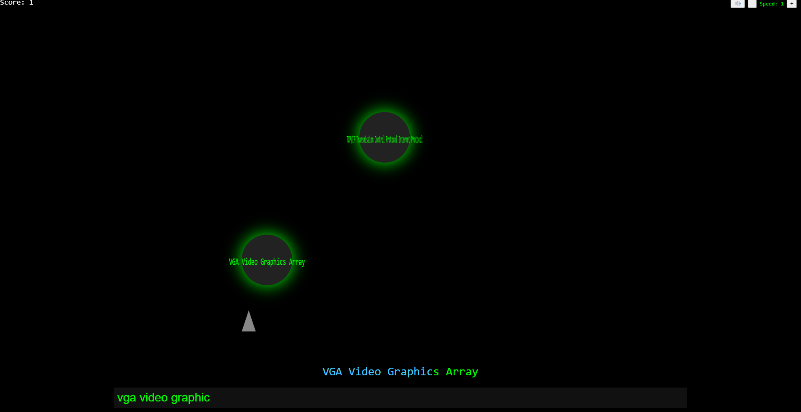

# CompTIA A+ Typing Blaster

A fun, interactive typing game to help you master CompTIA A+ acronyms and definitions!

Type the full term and definition as the orbs fall—get instant feedback, score points, and learn as you play.


## Features

- All CompTIA A+ acronyms and definitions (case-insensitive, punctuation ignored)
- Dynamic falling orbs with smooth animations
- Instant feedback: Correct letters are highlighted in blue, mistakes in red
- Sound effects (toggle on/off)
- Adjustable speed (on-screen controls)
- Responsive design for large screens
- Score tracking
- **Work in progress:** Security+ version coming soon!

## How to Play

1. Clone or download this repository.
2. Open `index.html` in your browser (or use [Live Server](https://marketplace.visualstudio.com/items?itemName=ritwickdey.LiveServer) in VS Code).
3. Type the full term and definition shown on the orb (e.g., `DDoS Distributed Denial of Service`) and press Enter.
4. Adjust speed or toggle sound using the buttons in the top right.

## Example Acronyms

- `DDoS Distributed Denial of Service`
- `BIOS Basic Input Output System`
- `DHCP Dynamic Host Configuration Protocol`
- ...and more!

## Development

This project is a **work in progress**.
A future version will include **CompTIA Security+ acronyms** and more advanced features.

### Contributing

Pull requests and suggestions are welcome!
Please open an issue to discuss your ideas.

---

## File Structure

```
index.html         # Main game file
README.md          # Project overview and instructions
screenshot.png     # (Optional) Screenshot of the game
```

---

## License

MIT License

---

**Stay tuned for the Security+ version!**
